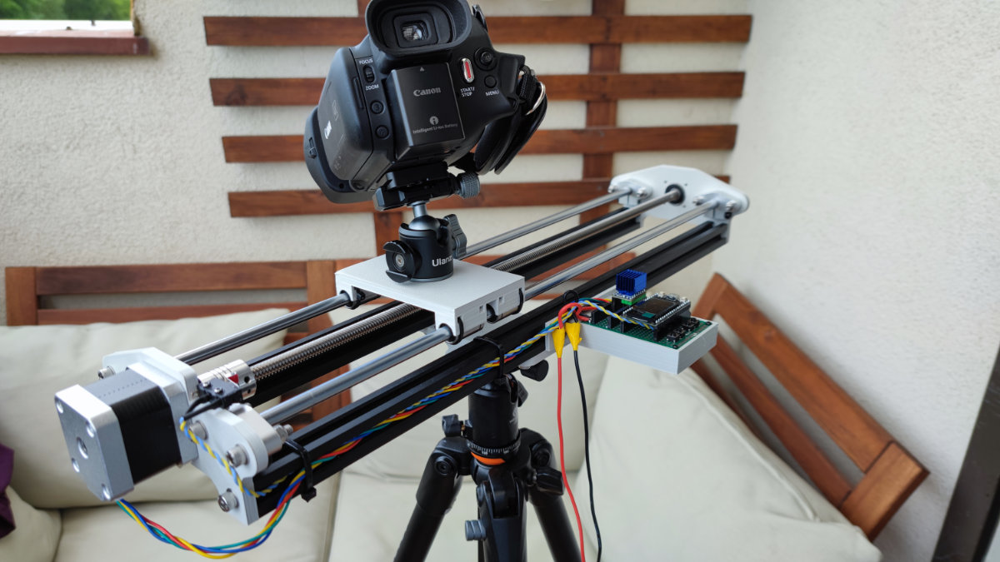
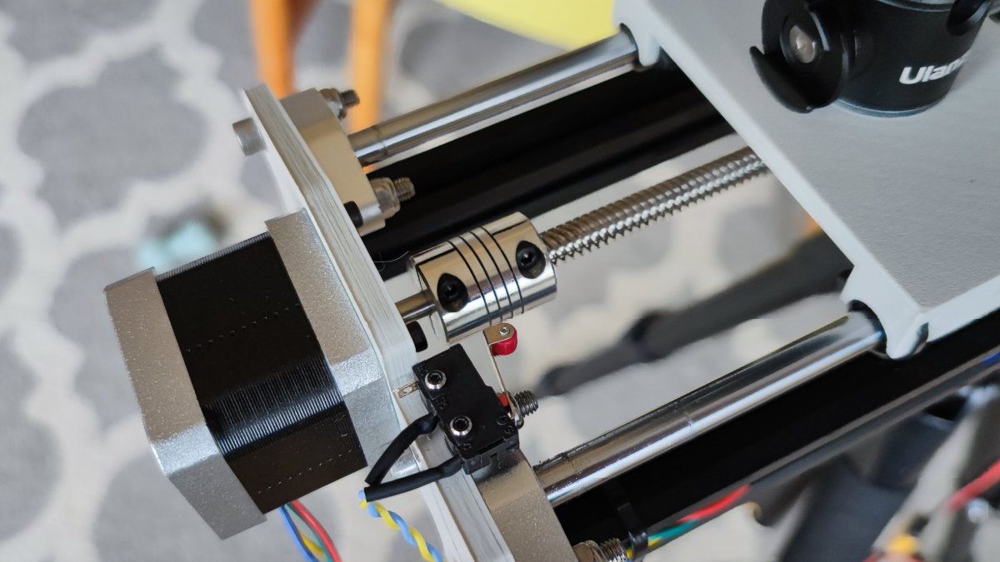
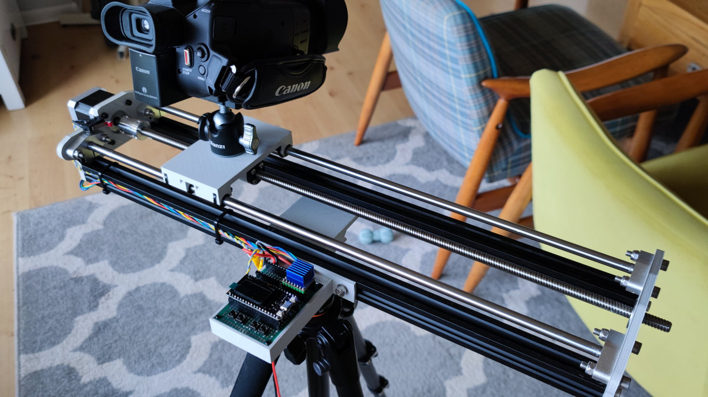
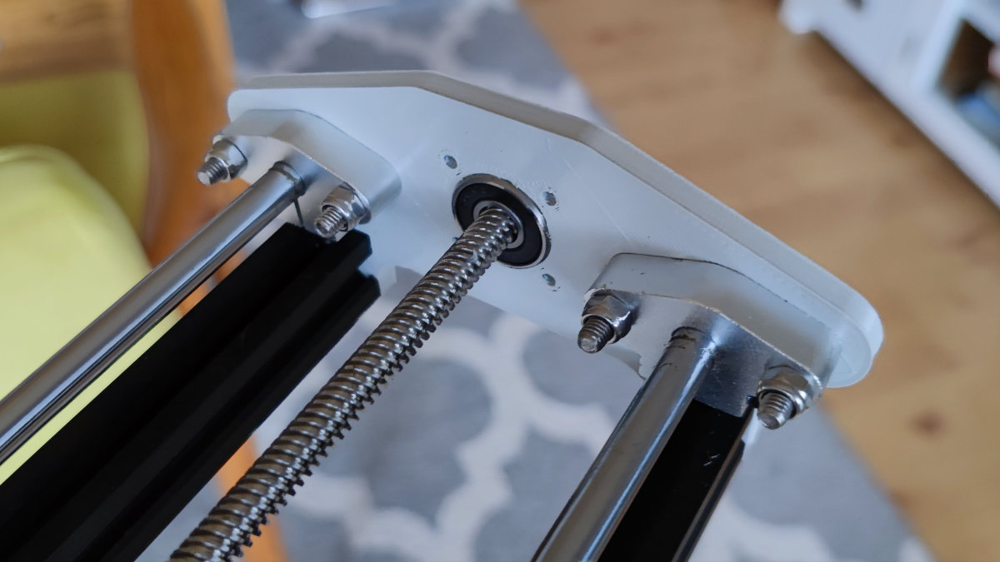

# DIY Motorized Camera Slider

Video presentation https://youtu.be/z8LCp77dOxo

# ESP32 pinouts

| Function | ESP32 pin |
| ---       | ---       |
| TMC2209 direction pin | 13 |
| TMC2209 step pin | 12 |
| End-stop switch | 17 |
| TMC2209 Enable    | 14 |
| Button #1 | 21 |
| Button #1 | 22 |
| Button #1 | 19 |
| Button #1 | 23 |

# User interface

Web Interface over WiFi is recommended. Connect to `DiyCameraSlider` WiFi with password `123456789` and use `http://192.168.4.1` URL.

Buttons are for emergency situations.

# Other

* TMC2209 should be configured in 8 microstep mode - MS1 and MS2 pulled to GND
* Tripod mount is compatible with Arca Swiss

#  Dependencies

* [AsyncTCP](https://github.com/me-no-dev/AsyncTCP)
* [ESPAsyncWebServer](https://github.com/me-no-dev/ESPAsyncWebServer)

# BOM

* [TTGO ESP32 with OLED](https://bit.ly/2G3qTSO)
* [TMC2209 stepper driver](https://bit.ly/3yxFSKa)
* [Tactile buttons](http://bit.ly/2Kzawy3)
* 60x90 universal PCB
* [TR8 8mm lead screw nut](https://bit.ly/3jS5PQQ)
* [NEMA17 stepper motor](https://bit.ly/3yv4bZh)
* [T8 8mm lead screw](https://bit.ly/3hDNhRs)
* [2x 500mm linear rod 8mm diameter](https://bit.ly/3eajnDF)
* [5x8mm coupler](https://bit.ly/3dMOrZR)
* [4x linear rod holder](https://bit.ly/3xndEBR)
* [4x LM8UU linear bearings](https://bit.ly/36hJqUK)
* 608 2RS 8x22x7mm bearing
* [Tripod head](https://bit.ly/3wtL7te)
* Tripod screw to attach the head
* M3 and M5 nuts and screws
* End switch
* 5V stepdown voltage regulator
* cables